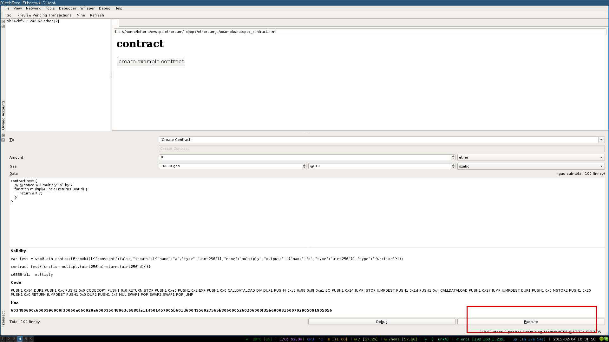
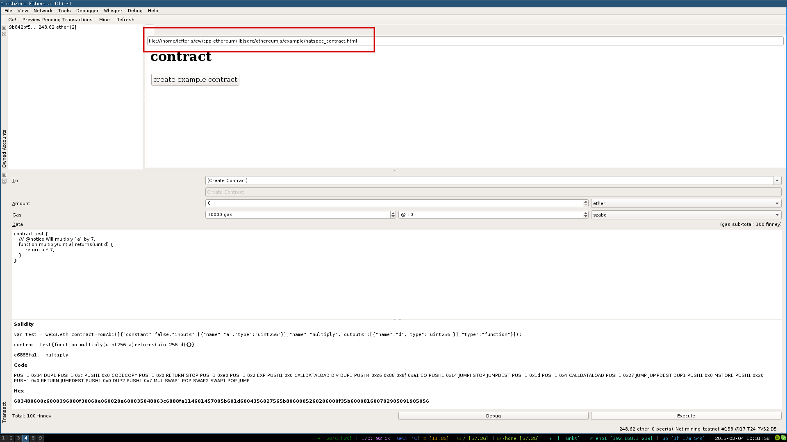
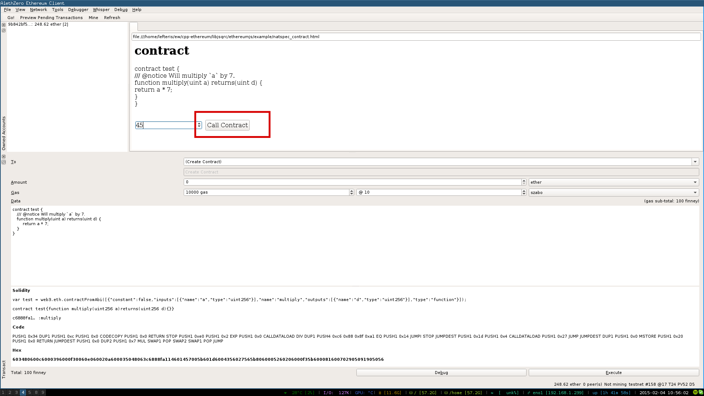
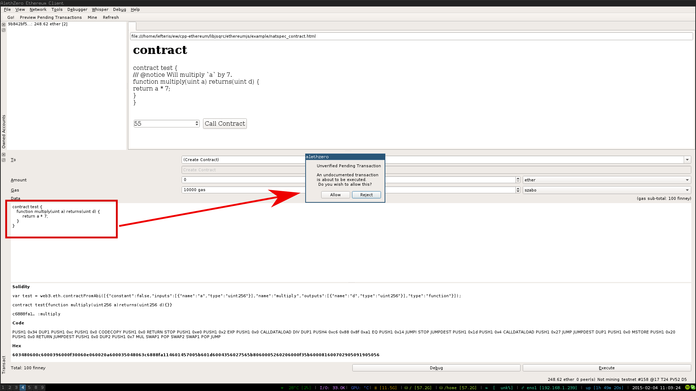

# Introduction

This is intended as an example of proof of concept of the natspec evaluation in Alethzero, the CPP client and as a showcase of the functionality of Natspec comments.

# Steps

## Create the natspec documentation

Open up alethzero client and type in the following contract that we will use as an example

```
contract test {
   /// @notice Will multiply `a` by 7.
   function multiply(uint a) returns(uint d) {
       return a * 7;
   }
}
```



Then press the `Execute` button in order to generate the contract creation transaction. We can do that from the JSON Api too but we are using AlethZero in order to create the natspec documentation from the contract. Pressing the execute button will create a local database entry (LevelDB) of a mapping of the contract's hash to the natspec documentation.

This is just a temporary solution to showcase the functionality of natspec. The idea is for people to be able to retrieve natspec documentations of contracts from a trusted authority which most users can trust.

## Open up the example contract


We will be using the JSON Api to try and perform the only transaction that our example contract has defined in its interface. Open up Alethzero's internal browser and type in the following path to get to our example `/path/to/cpp-ethereum/libjsqrc/ethereumjs/example/natspec_contract.html`.

You should see a page similar to below. Press the button to start the example.

## Performing the transaction

This is the interface our _application_ has for the contract. Using the textbox we can provide the input to the transaction and then execute it. 

## Authentication

At this final stage is where natspec actually comes into place. Each and every transaction has an authentication stage. The natspec documentation is what is provided to the user in order to notify him of the transaction and query whether or not to go ahead with it.


As you can see from the picture below even if a contract's transaction does not have any specific documentation we will still get a generic popup message asking us whether or not we want to authenticate the transaction.
